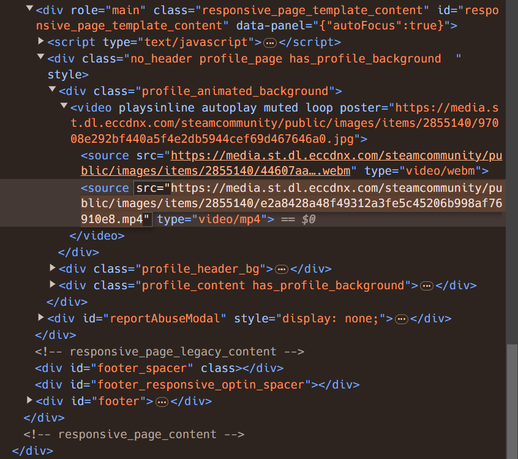
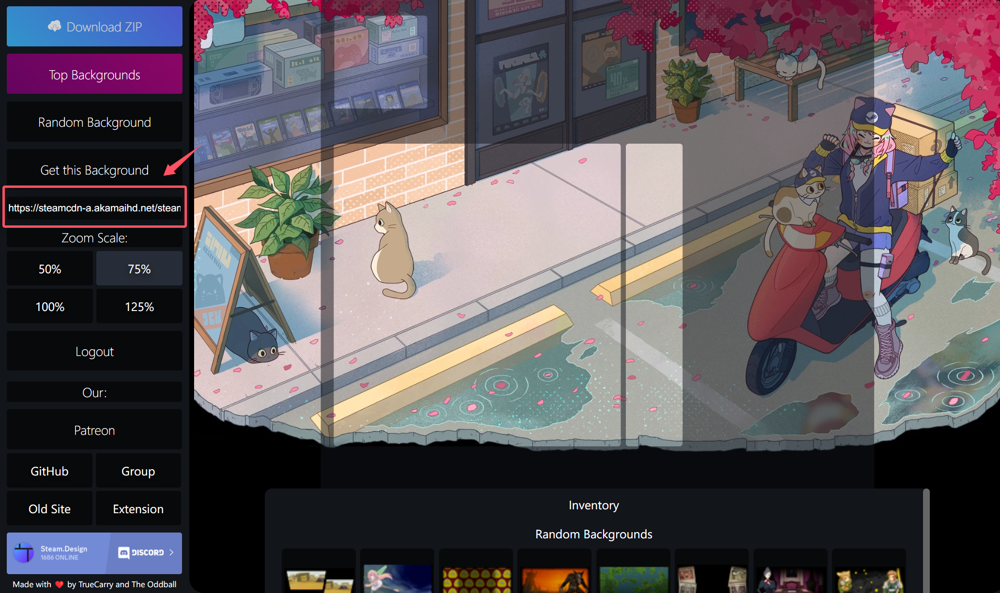

# 通过艺术作品展柜美化 Steam 个人资料

## 效果展示


## 教程

### 在开始之前

请确保您的 Steam 等级 >= 10 级，否则将无法使用个人资料展柜。

### 切割背景图片

基于 Steam Design 实现背景图片的切割，减少繁复劳作。

浏览器打开个人资料主页，按 `F12` 打开控制台，在 **元素（Elements）** 标签页找到当前使用的背景图的 URL：



例如，笔者目前的背景图的 URL 为：

```plaintext
https://media.st.dl.eccdnx.com/steamcommunity/public/images/items/2855140/e2a8428a48f49312a3fe5c45206b998af76910e8.mp4
```

由于 Steam Design 站点无法跨域访问 Steam CDN 上的文件，需替换链接地址为 [Backgrounds Gallery](https://backgrounds.gallery/) 的地址，即替换地址中的域名 `media.st.dl.eccdnx.com` 为 `steamcdn-a.akamaihd.net`。替换后的 URL 形如：

```plaintext
https://steamcdn-a.akamaihd.net/steamcommunity/public/images/items/2855140/e2a8428a48f49312a3fe5c45206b998af76910e8.mp4
```

浏览器访问 [Steam Design](https://steam.design/)，将替换后的 URL 粘贴到左侧输入框：



便有了实时预览效果！点击左上方的 **Download ZIP** 按钮，下载切割后的文件即可。

对于动态背景，由于 Steam 艺术作品不支持 `.mp4` 格式，因此需要手动转为 `.gif` 文件。笔者使用了 [ScreenToGif](https://www.screentogif.com/) 工具转换，此处不表。

### 上传艺术作品

浏览器打开 Steam [上传艺术作品](https://steamcommunity.com/sharedfiles/edititem/767/3/)页面。

给艺术作品取一个名字。可以使用特殊字符来隐藏显示，例如复制下面的内容：

```plaintext
󠀡󠀡
```

选择刚刚的艺术作品。

打开控制台，在 **控制台（Console）** 标签页输入如下代码（返回值如果为 0 的话，请等待艺术作品上传成功或重新选择艺术作品）：

```js
// 这段代码修改了上传的艺术作品的高度和宽度，避免在展柜里错误的显示效果
const num = document.getElementsByName("image_width")[0].value;
document.getElementsByName("image_height")[0].value = 1;
document.getElementsByName("image_width")[0].value = num * 100;
```

描述无需填写。

设置可见性为 **公开**。

保证艺术作品是你创作的。好吧，勾选它吧。

最后提交即可！重复上述步骤，上传另一张艺术作品。

### 设置展柜

前往 **编辑个人资料 - 已展示的展柜** 页面，将第一个展柜选择为 **艺术作品展柜**。

等待艺术作品审核通过，选择刚刚上传的两张艺术作品即可。

## 参考教程

- [【小教程】steam长展柜制作](https://blog.csdn.net/qq_44275286/article/details/107031450)
- [手把手教你如何美化 Steam 主页](https://blog.yuki.sh/posts/daf9288c81ba)
