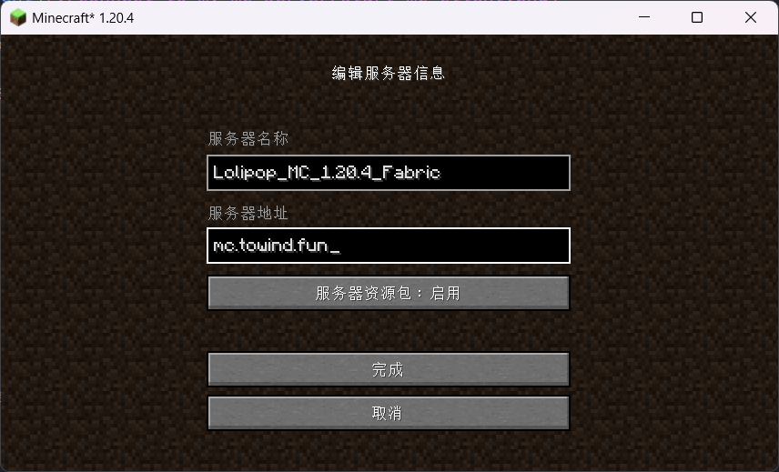

# 连接到 Lolipop 的 Minecraft 服务器

## 服务器地址

`mc.towind.fun`

## 服务器版本

- **Minecraft** 1.20.4（2023/12/07）
- **Fabric** 0.15.10
- **Fabric API** 0.97.0

已关闭正版验证，支持任何玩家访问服务器。

## 服务器预设模组

您可以在 [Modrinth](https://modrinth.com/mods) 或 [CurseForge](https://www.curseforge.com/minecraft/search?class=mc-mods) 找到用于自定义 Minecraft 游玩体验的模组，按需引入。

> 模组需放置在 `PCL 2.7.1\.minecraft\versions\1.20.4-Fabric 0.15.10\mods` 目录。

服务器预设模组的选择秉承**不增删游戏内容**的基本原则。未来可能添加大型服务器模组以拓展可玩性。

服务器预设模组列表如下：

### 模组自动分发

当手动添加此模组后，服务器才会自动分发其它预设模组。

- [Auto Modpack](https://modrinth.com/mod/automodpack/version/1ZPaL1PB) 4.0.0-beta1

### 体验增强

- [Journey Map](https://modrinth.com/mod/journeymap/version/1.20.4-5.9.25-fabric) 5.9.25
- [Just Enough Items](https://modrinth.com/mod/jei/version/17.3.0.52) 17.3.0.52
- [Skin Shuffle](https://modrinth.com/mod/skinshuffle/version/1.1.0+1.20.4) 1.1.0
- [WTHIT](https://modrinth.com/mod/wthit/version/fabric-10.6.0) 10.6.0

### 视觉动画

- [3D Skin Layers](https://modrinth.com/mod/3dskinlayers/version/3a5RPvFY) 1.6.4，不兼容 HD Skins 和 Epic Fight Mod
- [Iris Shaders](https://modrinth.com/mod/iris/version/1.7.0+1.20.4) 1.7
- [Not Enough Animations](https://modrinth.com/mod/not-enough-animations/version/OwhUSOUM) 1.7.3

### 声音沉浸

- [Sound Physics Remastered](https://modrinth.com/mod/sound-physics-remastered/version/fabric-1.20.4-1.3.1) 1.3.1

### 性能优化

- [Ferrite Core](https://modrinth.com/mod/ferrite-core/version/6.0.3-fabric) 6.0.3
- [Lithium](https://modrinth.com/mod/lithium/version/mc1.20.4-0.12.1) 0.12.1
- [Memory Leak Fix](https://modrinth.com/mod/memoryleakfix/version/v1.1.5) 1.1.5
- [Sodium](https://modrinth.com/mod/sodium/version/mc1.20.4-0.5.8) 0.5.8
- [Starlight](https://modrinth.com/mod/starlight/version/1.1.3+1.20.4) 1.1.3

### 其它模组

- [Bad Packets](https://modrinth.com/mod/badpackets/version/fabric-0.6.1) 0.6.1，模组 WTHIT 的必要依赖
- [Better Ping Display](https://modrinth.com/mod/better-ping-display-fabric/version/1.20.4-1.1.1) 1.1.1
- [Better Statistics Screen](https://modrinth.com/mod/better-stats/version/3.9.7+fabric-1.20.4) 3.9.7
- [Chat Heads](https://modrinth.com/mod/chat-heads/version/e4XWJ2pL) 0.12.0
- [Mod Menu](https://modrinth.com/mod/modmenu/version/9.2.0-beta.2) 9.2.0-beta.2

## 管理员使用的资源包

您可以在 [Modrinth](https://modrinth.com/resourcepacks) 或 [CurseForge](https://www.curseforge.com/minecraft/search?class=texture-packs) 找到用于增强视觉、音效体验等的资源包，按需引入。

> 资源包需放置在 `PCL 2.7.1\.minecraft\versions\1.20.4-Fabric 0.15.10\resourcepacks` 目录。

作为参考，服务器管理员引入了如下的资源包：

- [Round Trees](https://modrinth.com/resourcepack/round-trees/version/7.1) 7.1
- [Stay True](https://www.curseforge.com/minecraft/texture-packs/stay-true/files/5270000) 1.20.4

## 管理员使用的光影包

光影包可以**显著提升**游玩的视觉体验（同时大大提升机器配置要求），您可以在 [Modrinth](https://modrinth.com/shaders?g=categories:%27iris%27) 或 [CurseForge](https://www.curseforge.com/minecraft/search?class=shaders) 找到并下载它们，按需引入。

> 光影包依赖于 [Iris Shaders](https://modrinth.com/mod/iris) 或其它光影加载器。如果您使用了 Auto Modpack 模组，那么 Iris Shaders 将自动被安装。
>
> 安装加载器并首次启动游戏，会创建 `PCL 2.7.1\.minecraft\versions\1.20.4-Fabric 0.15.10\shaderpacks` 目录，将光影包放置到该目录即可。

作为参考，服务器管理员添加了如下的光影包，在游戏中可以随时切换：

- [Complementary Shaders - Reimagined](https://modrinth.com/shader/complementary-reimagined/version/r5.1.1) r5.1.1

## 派大星都能看懂的加入服务器步骤

### 安装 Plain Craft Launcher

访问 `https://download.towind.fun/PCL2-2.7.1.zip` 或者[爱发电](https://afdian.net/p/0164034c016c11ebafcb52540025c377)下载 Plain Craft Launcher 2，解压到任意目录，打开。

下载与[服务器版本](#服务器版本)相对应的 MC 客户端，如下图所示：

### （推荐）安装 Auto Modpack 模组

服务器通过模组 [Auto Modpack](https://modrinth.com/mod/automodpack/version/1ZPaL1PB) 自动分发其它的预设模组，您可以下载它并放置在客户端的模组文件夹中（可以在启动器的“版本设置 - 概览 - Mod 文件夹”处快速打开），这样的话，在连接服务器时，将自动获取最新的模组列表。首次进入服务器时会看到下面的内容，点击“下载”即可：

当然，这**不是**必须的步骤，您可以根据自己的喜好自行组合模组。

### 启动游戏

通过微软 OAuth 2.0 验证，登录到您的 Minecraft 账号，启动游戏：

如果没有购入正版，选择以离线的方式启动游戏：

### 连接到服务器

选择“多人游戏”，点击“添加服务器”，进入到“编辑服务器信息”页面。其中“服务器名称”可任意填写，例如 `Lolipop_MC_1.20.4_Fabric`；“服务器地址”填写 `mc.towind.fun`；“服务器资源包”设置为 `启用`。如下图所示：

连接到服务器即可！

## 服务器备份

服务器将在每天的北京时间凌晨 4 点自动进行备份，可以在[这里](https://1drv.ms/f/s!AmSmGMDAjYJui_5E5oKTM1iPF7OhhQ?e=Sit0PP)找到最近的七个备份文件。
