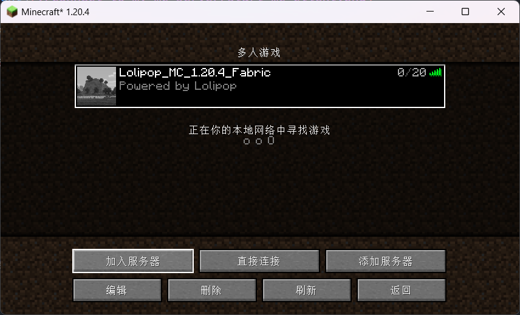

# 连接到我的 Minecraft 服务器

## 服务器地址

`mc.towind.fun`

## 服务器版本

- **Minecraft** 1.20.4
- **Fabric** 0.15.10
- **Fabric API** 0.97.0

已关闭正版验证，支持任何玩家访问服务器。

## 服务器预设模组

服务器预设模组的选择秉承**不增删游戏内容**的基本原则。

### 模组自动分发

- [AutoModpack](https://modrinth.com/mod/automodpack/version/1ZPaL1PB) 4.0.0-beta1

### 体验增强

- [JourneyMap](https://modrinth.com/mod/journeymap/version/1.20.4-5.9.25-fabric) 5.9.25
- [JustEnoughItems](https://modrinth.com/mod/jei/version/17.3.0.52) 17.3.0.52

### 性能优化

- [Lithium](https://modrinth.com/mod/lithium/version/mc1.20.4-0.12.1) 0.12.1
- [FerriteCore](https://modrinth.com/mod/ferrite-core/version/6.0.3-fabric) 6.0.3
- [MemoryLeakFix](https://modrinth.com/mod/memoryleakfix/version/v1.1.5) 1.1.5

### 其它模组

- [BetterPingDisplay](https://modrinth.com/mod/better-ping-display-fabric/version/1.20.4-1.1.1) 1.1.1

## 派大星都能看懂的操作步骤

访问 `https://download.towind.fun/PCL2-2.7.1.zip` 或者[这里](https://afdian.net/p/0164034c016c11ebafcb52540025c377)下载 Plain Craft Launcher 2，解压到任意目录，打开。

下载与[服务器版本](#服务器版本)相对应的 MC 客户端，如下图所示：

服务器通过模组 [AutoModpack](https://modrinth.com/mod/automodpack/version/1ZPaL1PB) 自动分发其它的预设模组，您可以下载它并放置在客户端的模组文件夹中（可以在启动器的“版本设置 - 概览 - Mod 文件夹”处快速打开），这样的话，在连接服务器时，将自动获取最新的模组列表。首次进入服务器时会看到下面的内容，点击“下载”即可：

当然，这**不是**必须的步骤，您可以根据自己的喜好自行组合模组。

通过微软 OAuth 2.0 验证，登录到您的 Minecraft 账号，启动游戏：

如果没有购入正版，选择以离线的方式启动游戏：

选择“多人游戏”，点击“添加服务器”，进入到“编辑服务器信息”页面。其中“服务器名称”可任意填写，例如 `Lolipop_MC_1.20.4_Fabric`；“服务器地址”填写 `mc.towind.fun`；“服务器资源包”设置为 `启用`。如下图所示：

连接到服务器即可！

