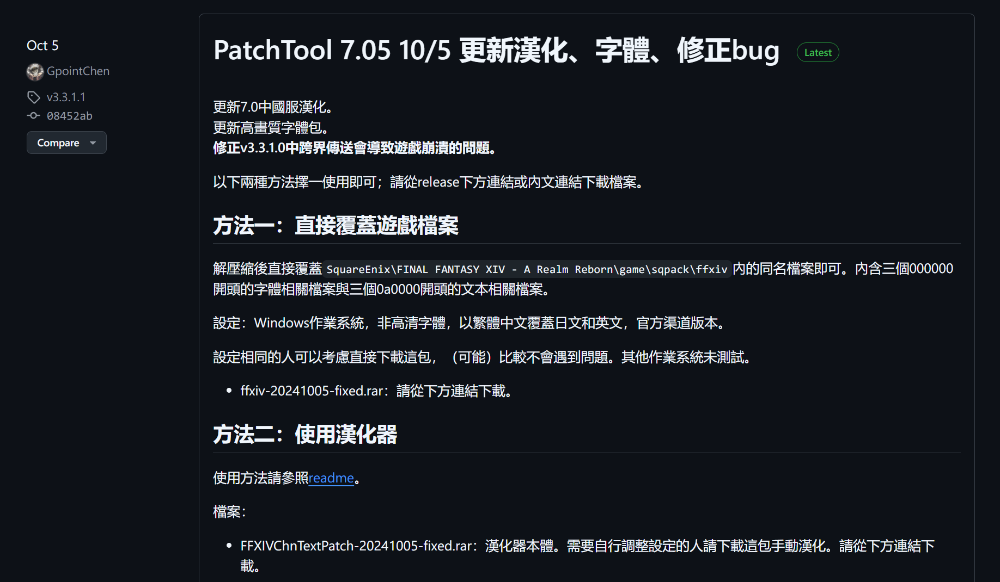
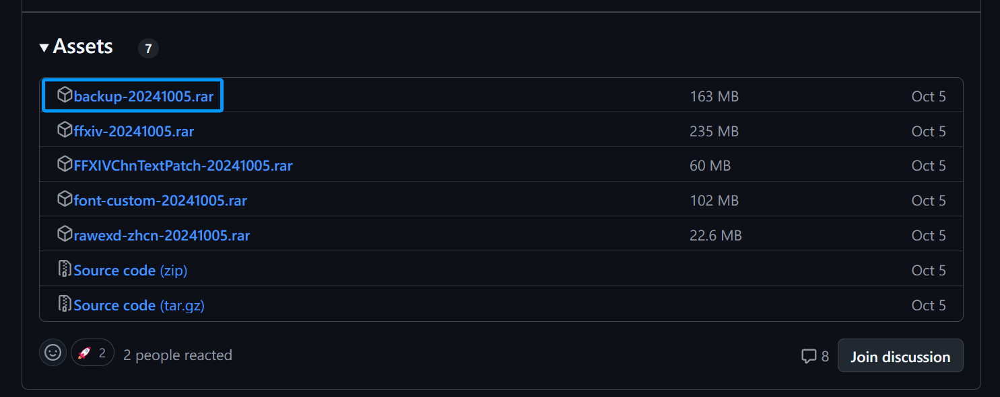
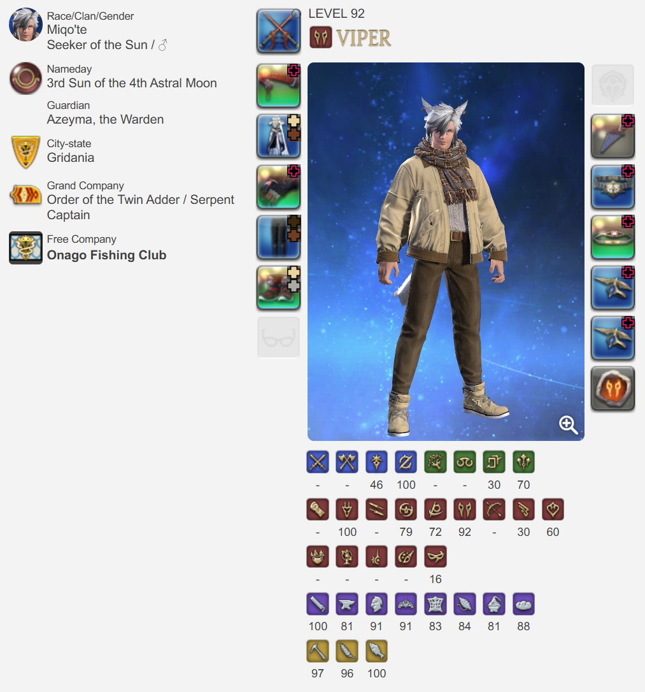

# 最终幻想 14 / Final Fantasy XIV 国际服入坑指北

本文档旨在帮助日文零基础或英语险胜四六级的好厚米们入坑 FF14 国际服，主要论述如何注册账号、下载客户端、汉化游戏等，此外加入自己作为程序员的理解与游戏实践，希望对您有所帮助。

## 修订版本

- 2024.11.08（1.0），撰写完成文档。

## 在开始之前

为什么我入坑的国际服？简单来说认为国际服环境更加单纯，对休闲玩家更加友好，事实也确实如此，挑战高难度副本即使灭队也没有人表达不满，我们可以一起学习、努力然后战胜 BOSS，这种成就感无与伦比。此外，和不同文化的其他国籍的人交流也算一番新奇体验。

游戏的**前期相当枯燥乏味**，技能循环像是小学生算数，副本难度像小学生考试。等到 60 级以后就开始慢慢弹钢琴了，副本挑战也变得艰辛起来，敬请见证。

游戏的可玩性与主线进度关联紧密，每个版本的新玩法和支线（或高难）副本几乎都在对应主线完成后解锁。苦行僧般地推主线吧！未来的你一定会感谢现在的自己的，光之跑腿！

至 7.0 版本为止，笔者最享受剧情的版本是 5.0，其次为 6.0。建议在每次开启新版本之前看看版本 PV，现在笔者偶尔都会翻出 5.0 的 PV 看上一看，光听歌都称得上享受：

- [2.0 重生之境](https://www.bilibili.com/video/BV1gz4y1U7fm/?p=2)，1 - 50 级
- [3.0 苍穹之禁城](https://www.bilibili.com/video/BV1gz4y1U7fm/?p=4)，50 - 60 级
- [4.0 红莲之狂潮](https://www.bilibili.com/video/BV1gz4y1U7fm/?p=5)，60 - 70 级
- [5.0 暗影之逆焰](https://www.bilibili.com/video/BV1gz4y1U7fm/?p=6)，70 - 80 级，剧情与战斗的巅峰
- [6.0 晓月之终途](https://www.bilibili.com/video/BV1gz4y1U7fm/?p=8)，80 - 90 级，主线章节的收束之地
- [7.0 金曦之遗辉](https://www.bilibili.com/video/BV1gz4y1U7fm/?p=11)，90 - 100 级

挑战 BOSS 的时候记得打开音响，感受史诗的叙事曲，享受第九艺术的冲击吧。

## 注册账号

FF14 账号的注册，游戏的激活和游玩时间的充值等操作都在 [Mog Station](https://secure.square-enix.com/account/app) 完成。由于包含 Google 验证码，需要使用**代理软件**；如果您没有代理软件，可以选择淘宝代注册，注意甄别商家。

为了避免触发萌新噩梦 i2502 错误代码，请务必注册**日版**的 Square Enix 账号。即在[此页面](https://secure.square-enix.com/oauth/oa/registligt.sendCountry?response_type=code&redirect_uri=https%3A%2F%2Fsecure.square-enix.com%2Faccount%2Fapp%2Fsvc%2Ftop%3Frequest%3Dinfo&client_id=account_manage)进行账户注册操作时，国籍 / 地域选择 Japan：

## 游戏购买与付费机制

FF14 提供了**试玩版**供您试错，看看您是否适合入坑这个游戏。除了一些功能限制外，您可以免费、无限时间游玩 2.0 - 4.x 版本（对应 1 - 70 级）的所有内容。

如果您想要继续玩下去 —— 谢天谢地 —— 踏入 5.0 的征途吧！与国服不同，国际服还需要购买游戏本体与资料包才能游玩后续的内容，且每次推出资料片时还需要单独购买。

如上图蓝色方框勾选所示，正式入坑国际服意味着您需要首先花费 6380 日元 / Crysta 购买游戏本体与全部资料片。首次激活游戏时会附赠 30 天的游玩资格。

国际服采用月卡付费机制，日服最低为每月 1408 日元 / Crysta。

用于购买游戏和游玩时间的 Crysta 可以在淘宝等二次贩售商购买与代充（有代理软件的话建议购买后自行充值），注意甄别商家。

## 下载与启动客户端

推荐使用开源的 [FFXIVQuickLauncher](https://github.com/goatcorp/FFXIVQuickLauncher) 游戏启动器替代官方的启动器，具备保存账号密码到本地的功能，能一键打开游戏，此外还具备其它进阶能力。[在这里](https://github.com/goatcorp/FFXIVQuickLauncher/releases)下载它的最新版本：

打开后将自动安装国际版客户端到指定目录。

客户端下载、安装完毕后，输入账号密码即可启动游戏。

> **Is XIVLauncher safe to use?**
> We put a lot of effort into ensuring that XIVLauncher is safe to use for everyone.
> Please read through our FAQ entry on this matter if you want to know more.

FFXIVQuickLauncher 内置了插件加载器，未来如果需要，可以添加插件以提升游戏体验。存在一定的风险，请勿跳脸。

## 汉化游戏

使用开源的 [FFXIVChnTextPatch-GP](https://github.com/GpointChen/FFXIVChnTextPatch-GP) 工具来汉化游戏客户端。[在这里](https://github.com/GpointChen/FFXIVChnTextPatch-GP/releases)下载它：

参考里面的教程完成对客户端的汉化即可。

每次更新游戏客户端版本前建议使用此工具还原汉化，待客户端完成更新后再重新汉化，避免游戏客户端文件损坏。如果客户端文件损坏，也可以下载备份的文件替换本地文件：

汉化包也时常更新，每次游戏客户端版本更新时，可以回到这个页面下载最新的汉化文件（如果有）。

## 加速器

游玩国际服需配合加速器，裸连延迟非常高且容易丢包。

笔者使用 UU 加速器加速国际服日本节点，真实延迟平均为 330ms，对挑战副本几乎没有影响。

到此为止所有的准备都已完成，双击 FFXIVQuickLauncher，输入账号和密码，正式启动游戏吧！

## 服务器选择

笔者在国际服的 **Gaia - Bahamut** 服务器，如果您认识笔者，请务必来这个服务器贴贴……求你了。嗯，为什么选择这个服务器？因为巴哈姆特一听就很帅呀！

如果您不认识笔者，或者如果您是真正的 MMORPG 玩家，希望更方便地交流与攻克副本，推荐选择 **Mana** 里的任意服务器，国人圈子相对更大。您也可以提前加入国际服群，看看大家都在什么服务器。

## 成为新的光之战士

战斗职业按照职责分为坦克（蓝职）、治疗（绿职）和输出（红职）。简单描述各个职业的定位与职责就是：

- 治疗职业：难度最高，需要及时回复队友的血量，防止坦克倒下。由于治疗量的溢出，还需要承担相当于一个输出职业大约 40% 左右的输出。
- 坦克职业：难度中等，需要吸引怪物的仇恨，配合输出职业的站位，调谐副本的攻略节奏。
- 输出职业：难度最低，需要调整输出的站位，尽可能输出多的伤害。

建议您在开荒时选择推主线更快，副本体验更顺滑的**输出职业**。

如果想挑战其他职责的职业，可以在游玩过程中学习别人的操作与手法，再依葫芦画瓢吧！喔对了，一个角色可以游玩全部所有的职业，随时切换，不需要为每个职业单独开账号，所有的投资都是一比一的回报。

喔对了对了，在您的角色名字前面有个豆芽的图标，意味着您是全游戏生态链顶层的存在，您将得到最大程度的宽容，尽可以放心大胆地玩耍，而且在国际服，不必担心有什么操作会被诋毁。

重复再提一遍，前期的游戏体验相当枯燥乏味，但随着各种玩法与副本的解锁，一天的时间都不知道该怎么安排了，每个人几乎都能找到想做的事情然后沉浸在游戏世界里。愿我们终能相遇在水晶都，好运，光之战士！

## 其它贴士

下面是一些笔者的理解与配置，应该能带给您一些有益的启发。

### 物品搜索

虽然游戏客户端完成了汉化，但是诸如拍卖板物品还是需要使用**日文关键字**搜索，此时就要使用 Wiki 或其它工具来查了，这一点着实在体验上打了折扣。

例如要搜索装备 _完满木魔导弓_，可以访问 Wiki 页面 <https://ff14.huijiwiki.com/wiki/物品:完满木魔导弓>：

使用上图中的日文名 _インテグラル・マジテックボウ_ 在交易板搜索即可。

笔者则更常用开源的 [FFXIV Teamcraft](https://github.com/ffxiv-teamcraft/ffxiv-teamcraft) 工具搜索：

除此之外，FFXIV Teamcraft 还有很多强大的功能，例如记录生产手法，便捷配置为生产宏等，推荐给厚米们使用。

### 队伍交流

在国际服不可避免匹配到外国友人，理解队友在说什么有时候很重要（更多时候不重要）。笔者使用了开源的 [TataruHelper](https://github.com/NightlyRevenger/TataruHelper) 来实时翻译队友的发言：

简单配置以后即可显示：

您想交流时使用通用的英语即可。

### 在 Steam 展示游戏状态

使用 Steam 的**添加非 Steam 游戏**功能，将 FFXIVQuickLauncher 作为游戏选中，自定义游戏名，通过 Steam 启动即可：

现在您的 Steam 状态栏将显示您正在游玩游戏为刚刚自定义的游戏名。

## 参考指南

如果遇到笔者没有提及的问题，可以移步下面的指南：

- [FF14国际服超详细入坑指南](https://steamcommunity.com/sharedfiles/filedetails/?l=schinese&id=2186534821)，2024.04.13
- [【FF14】国际服入坑从入门到精通](https://www.bilibili.com/read/cv11570492)，2021.06.04
