# 最终幻想 14 / Final Fantasy XIV 国际服入坑指北

本文档旨在帮助日文零基础或英语险胜四六级的好厚米们入坑 FF14 国际服，主要论述如何注册账号、下载客户端、汉化游戏等，此外加入自己作为程序员的理解与游戏实践，希望对您有所帮助。

笔者自身是参考 NGA 上的这篇指南 [[国际服] 9102·国际服入坑指北](https://bbs.nga.cn/read.php?tid=15259943&rand=460) 入坑的国际服，除去一些过时内容，仍然值得您在本指北的基础上加以参考。

## 主要修订版本

- 2024.12.30（1.2），推荐使用 FFXIVChnTextPatch-Souma 进行游戏汉化。
- 2024.12.07（1.1），补充遗漏的小点。
- 2024.11.08（1.0），撰写完成文档。

## 为什么是 Final Fantasy XIV

FF14 作为一款 MMORPG 拥有如下令笔者喜爱的地方：

- **茫茫多的副本与挑战内容。** 副本分为四人本、八人本和二十四人本。主线剧情里的歼灭战难度面向普通玩家，能保证大家顺利过本，推动剧情；主线之外为每个歼灭战设计了歼极战（零式 / 绝境），难度面向进阶玩家和核心玩家，充满挑战和丰厚奖励（比如坐骑）。副本会同步装备品级，意味着无论新老玩家，在副本里都是性能平衡的，要依靠手法和努力完成攻略。
- **超高规格的音乐制作。** 在本身高质量音乐的基础上，通过乐器与鼓点的变奏表达战斗的高潮，某些副本里人声的加入更是将情绪推至巅峰。请务必打开音响游玩。
- **超多玩法的堆砌。** 七十级主线完成后开放禁地优雷卡探索，八十级南方博兹雅战线，九十级开拓无人岛，另外还有深层迷宫、变换迷宫、挖宝、地图 BOSS 狩猎、光（肝）武制作、金蝶游乐场、远航探索等等各种玩法，每个玩法自成一套体系，完成的奖励反映在武器、称号、坐骑等方面，带来成就感的正反馈。
- **恰到好处的生产玩法。** 作为上一点的补充，生产职业的玩法简单易上手，体系收敛，例如钓鱼只需要看到上钩提示后起钩，不需要再通过复杂操作得到钓鱼的结果，很适合打发时间。每个版本的超强力装备都可以通过生产职业制造，并在交易板上以合理的价格出售，这些生产出来的装备与战胜极难副本得到的最强力武器性能差距不到 5%，意味着人人皆可轻松达到版本毕业的状态，拥有挑战极难副本的入场券。
- **一个角色即是完整的游戏体验。** 一个角色即可游玩所有战斗职业和生产职业，体验游戏的全部内容，全心全意投入到一个角色上带来最棒的沉浸感。每个职业的输出循环、操作手法又各有千秋，学习、掌握到精通任何一个职业（你说得对，但这就是龙骑士，后跳 15 米躲过一切机制\*普通难度）都能带来游玩上的满足感。
- **舒适的画风。** 游戏画风和人物建模正中笔者好球区，即使模型精度低也并不会引起视觉上的不适。哪怕站在主城挂机也要凹一个好看的造型，守望人群熙熙攘攘，看着别人的打扮、动作收获社交的乐趣。从这点出发，笔者并不会去玩像 WOW 这样的 MMORPG，尽管它长期都受到全世界玩家的热爱。
- **部队与房屋系统。** 毕竟是 MMORPG，与陌生人的邂逅、了解和熟识是不得不品的一环。FF14 拥有大家一起共建的部队系统，允许部队购入一块属于自己的地皮，在上面搭建功能丰富的部队房屋，作为部队里的一员也可以拥有自己房间，设计并邀请别人来参观。聚会其中，其乐融融。
- **世界观构筑和剧情展开令人沉浸。** 以单机游戏的规格制作的主线剧情，还有一些有趣的特殊支线剧情（非正统调查员、光之邮递员等等），造就了一套独特的游戏文化，构筑了一个充满活力的世界观，令人沉浸其中，对于游戏来说亦是长久发展的生命线。

媒体评价方面，FF14 获得了 TGA 如下提名与奖项：

| 年度 | 奖项                                                                 |
| ---- | -------------------------------------------------------------------- |
| 2019 | 最佳角色扮演游戏（提名），最佳运营游戏（提名），最佳社群支持（提名） |
| 2021 | 最佳社群支持，最佳持续经营游戏                                       |
| 2022 | 最佳社群支持，最佳持续经营游戏                                       |
| 2023 | 最佳社群支持（提名），最佳持续经营游戏（提名）                       |
| 2024 | 最佳社群支持（提名），最佳持续经营游戏（提名）                       |

至于为什么笔者入坑的是国际服呢？简单来说笔者认为国际服环境更加单纯，对休闲玩家更加友好。事实也确实如此，挑战高难度副本即使灭队也没有人表达不满，我们可以一起学习、努力然后战胜 BOSS，这种成就感无与伦比。关于这点，论坛上也有[一些声音与挑战](https://bbs.nga.cn/read.php?tid=40652678)，可供参考。此外，和不同文化的其他国籍的人交流也算一番新奇体验。

加入国际服也意味着您需要有一定的**自强**能力，找寻方法改善自己的游玩体验，实现与其它语言玩家的无虞沟通，融入不同国家社群的游戏文化。如果这一切令您生畏的话，还是选择国服吧。

当然，FF14 远非完美无虞，这里能看到不少的[反噬与愤懑](https://www.saraba1st.com/2b/thread-2185571-1-1.html)，直指 6.x 版本开始的体验上的重复高与设计上的不走心问题。从 2024 年的节奏来看，WOW 的版本迭代内容更胜一筹，值得称道。当然，笔者尚处于与 FF14 相伴的甜蜜期，这些批评丝毫没有影响到笔者从游戏中获取到的快乐，等到某一天笔者也成为了老登，因游戏内容的匮乏而丧失打开游戏的兴趣后，再来声讨吉田老贼吧。

## 在开始之前

游戏的**前期相当枯燥乏味**，技能循环像是小学生算数，副本难度像小学生考试。等到 60 级以后随着技能的解锁，怪物机制的堆砌，战斗体验就开始迈入佳境了，看到过一个相当贴切的描述：弹钢琴。

游戏的可玩性**与主线进度关联紧密**，每个版本的新玩法和支线（或高难）副本几乎都在对应主线完成后解锁。而更新了十年的游戏内容也非一朝一夕能够打完的 —— 苦行僧般地推主线吧，未来的你一定会感谢现在努力的自己的 XD。粗略统计，从创建角色到完成 7.0 主线剧情，大约需要花费 200 小时的时间。

每次开启新版本之前不妨先看看版本 PV，时至今日，笔者偶尔会翻出 5.0 的 PV 看上一看，光听歌都称得上享受：

- [2.0 重生之境](https://www.bilibili.com/video/BV1gz4y1U7fm/?p=2)，1 - 50 级
- [3.0 苍穹之禁城](https://www.bilibili.com/video/BV1gz4y1U7fm/?p=4)，50 - 60 级
- [4.0 红莲之狂潮](https://www.bilibili.com/video/BV1gz4y1U7fm/?p=5)，60 - 70 级
- [5.0 暗影之逆焰](https://www.bilibili.com/video/BV1gz4y1U7fm/?p=6)，70 - 80 级，剧情与战斗的巅峰
- [6.0 晓月之终途](https://www.bilibili.com/video/BV1gz4y1U7fm/?p=8)，80 - 90 级，主线章节的收束之地
- [7.0 金曦之遗辉](https://www.bilibili.com/video/BV1gz4y1U7fm/?p=11)，90 - 100 级

## 注册账号

FF14 账号的注册，游戏的激活和游玩时间的充值等操作都在 [Mog Station](https://secure.square-enix.com/account/app) 完成。由于包含 Google 验证码，需要使用**代理软件**；如果您没有代理软件，可以选择淘宝代注册，注意甄别商家。

为了避免触发萌新噩梦 i2502 错误代码，请务必注册**日版**的 Square Enix 账号。即在[此页面](https://secure.square-enix.com/oauth/oa/registligt.sendCountry?response_type=code&redirect_uri=https%3A%2F%2Fsecure.square-enix.com%2Faccount%2Fapp%2Fsvc%2Ftop%3Frequest%3Dinfo&client_id=account_manage)进行账户注册操作时，国籍 / 地域选择 Japan：

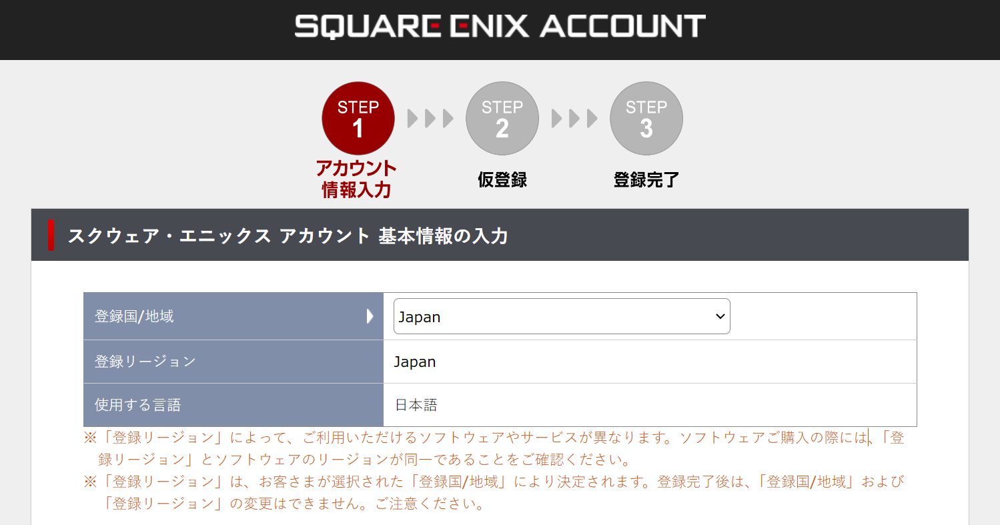

## 游戏购买与付费机制

在没有正式购买游戏之前，您可以免费、无限时间游玩 2.0 - 4.x 版本（对应 1 - 70 级）的所有内容。作为试玩版账号，存在一些功能上的限制，例如：

- 无法使用市场交易板，也无法跟玩家面对面交易。意味着装备和食物都要自己搓，部分场所可以通过交易板偷懒的部分也只能手打了。
- 金币持有上限为 300,000。建议在达到上限前在 NPC 处购入方便未来在市场交易板换金的道具，例如暗物质。
- 无法向玩家发起私聊，也无法使用地图喊话。使用的情感动作不会记录在聊天栏。
- 如果服务器负载较高（通常发生在中型版本更新时），将无法排队进入游戏。

如果您想要继续玩下去 —— 谢天谢地 —— 踏入 5.0 的征途吧！与国服不同的是，在国际服还需要购买游戏本体与资料包才能游玩后续的内容，且每次推出新的大型资料片时还需要单独购买。

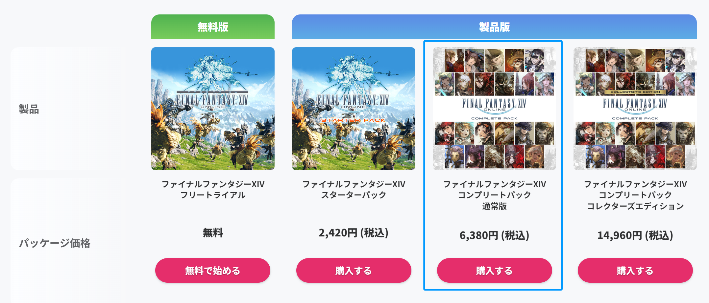

如上图蓝色方框勾选所示，正式入坑国际服意味着您需要首先花费 6380 日元 / Crysta 购买游戏本体与全部资料片。周年庆（夏）和圣诞节（冬）期间，官方商城通常会迎来不小的折扣活动，游戏本体与资料片也会同步打折，想省钱的玩家可以等到此时购买。由于汇率的缘故，购买**日版游戏**会更便宜，且月卡和官方商城付费道具相比美版**便宜近一半**！因此不要看到美版打折就傻戳戳去买了，一定要等日版！！

国际服采用月卡付费机制，日服最低为每月 1408 日元 / Crysta。首次激活游戏时会附赠 30 天的游玩资格。在此期间可以找笔者或其他人要一个招待码并在 [Mog Station](https://secure.square-enix.com/account/app/svc/ffxivshopacctop) 激活，能拿到一些[不错的奖励](https://jp.finalfantasyxiv.com/lodestone/special/friend_recruit/?utm_source=lodestone&utm_medium=pc_banner&utm_campaign=jp_friendrecruit)，**赠送的游玩资格结束后就无法再使用招待码啦**。

用于购买游戏和游玩时间的 Crysta 可以在淘宝等二次贩售商购买与代充（有代理软件的话建议购买后自行充值），注意甄别商家。

## 下载与启动客户端

推荐使用开源的 [FFXIVQuickLauncher](https://github.com/goatcorp/FFXIVQuickLauncher) 游戏启动器替代官方的启动器，具备保存账号密码到本地的功能，能一键打开游戏，此外还具备其它进阶能力。[在这里](https://github.com/goatcorp/FFXIVQuickLauncher/releases)下载它的最新版本：

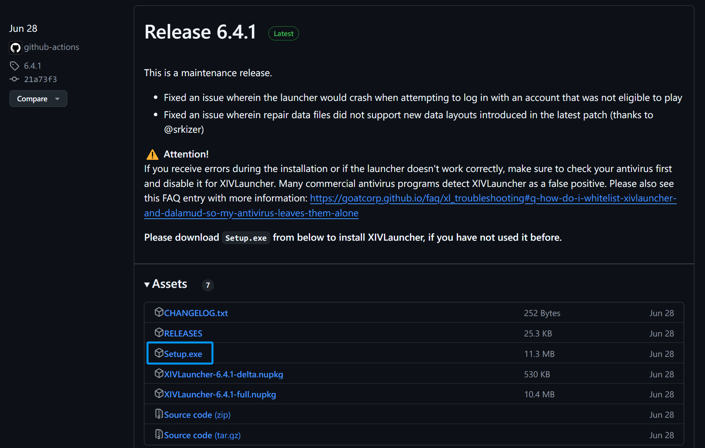

打开后将自动安装国际版客户端到指定目录。

客户端下载、安装完毕后，输入账号密码即可启动游戏。

> **Is XIVLauncher safe to use?**
> We put a lot of effort into ensuring that XIVLauncher is safe to use for everyone.
> Please read through our FAQ entry on this matter if you want to know more.

FFXIVQuickLauncher 内置了 Dalamud 卫月插件加载器，未来如果需要，可以添加插件以提升游戏体验。存在一定的风险，请勿跳脸。

## 汉化游戏

如果您想要更**最佳的游戏汉化体验**，推荐使用开源的 [FFXIVChnTextPatch-Souma](https://github.com/Souma-Sumire/FFXIVChnTextPatch-Souma) 模组来汉化游戏客户端。

傻瓜式的汉化方案是：下载最新版本的[汉化后游戏文件](https://github.com/Souma-Sumire/FFXIVChnTextPatch-Souma/releases)（命名形如 `7.15.v3.zip`），将解压后得到的文件覆盖到 `FINAL FANTASY XIV - A Realm Reborn\game\sqpack\ffxiv` 目录。

拓展性更好的汉化方案是：

1. 在 Dalamud 的设置页面添加 Penumbra 仓库地址 `https://raw.githubusercontent.com/xivdev/Penumbra/master/repo.json`，然后搜索并安装 Penumbra。如下图所示：

   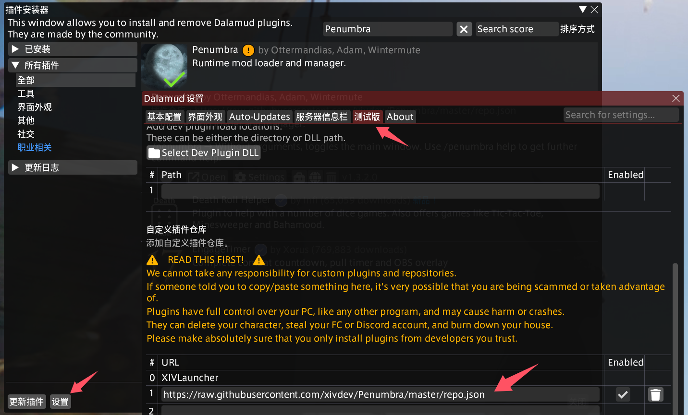

2. 下载必要的[字体模组](https://github.com/Souma-Sumire/FFXIVChnTextPatch-Souma/releases/download/v2.4.4/HarmonyOS.Sans.pmp)和最新版本的[汉化模组文件](https://github.com/Souma-Sumire/FFXIVChnTextPatch-Souma/releases)（命名形如 `7.15.v3.Mod.zip`），解压后通过 Penumbra 导入，完成对游戏客户端的汉化。如下图所示：

   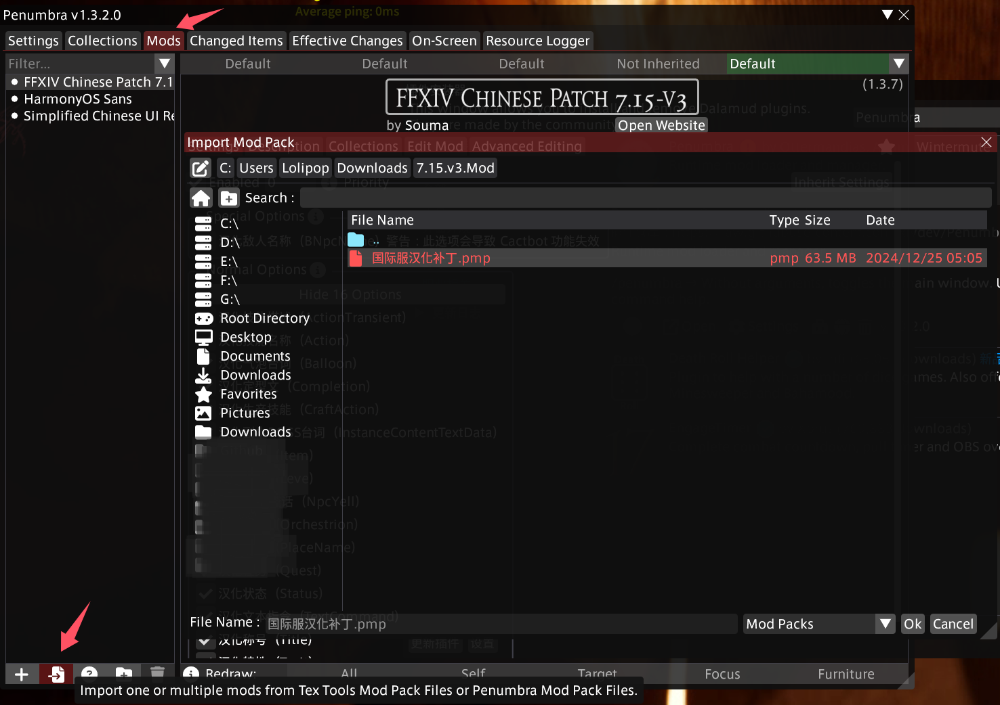

3. 在此基础上，还可以引入 [Simplified Chinese UI Replacement](https://www.nexusmods.com/finalfantasy14/mods/2048) 模组，实现对 UI 界面的完整汉化。汉化后的 UI 界面如下图所示：

   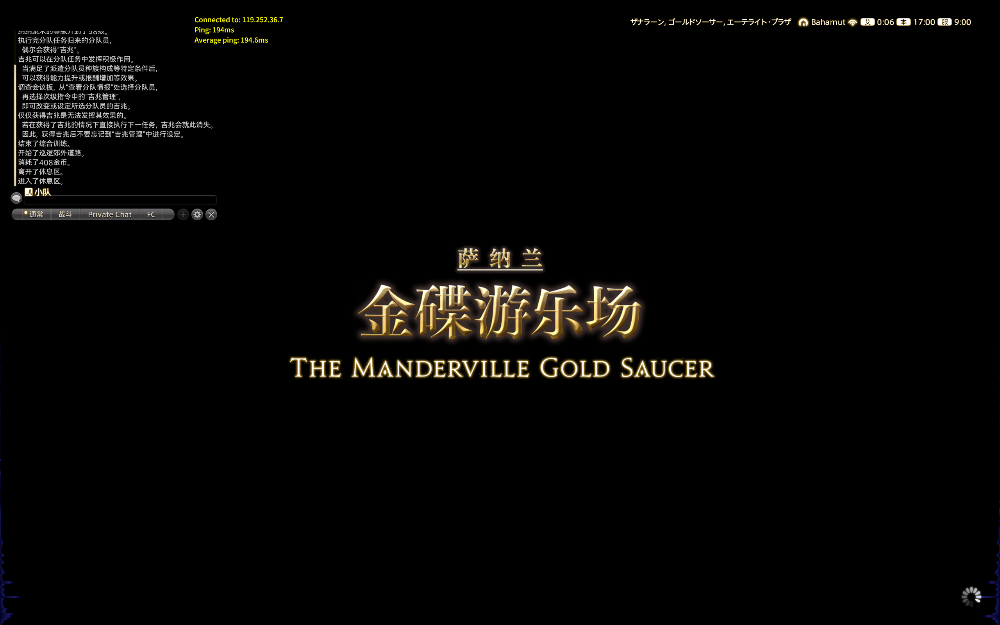

过去笔者用过的汉化方案是：基于开源的 [FFXIVChnTextPatch-GP](https://github.com/GpointChen/FFXIVChnTextPatch-GP) 工具来汉化游戏客户端，详细步骤请参考其文档。一个比较大的缺陷是[物品搜索](#物品搜索)等地方还是需要用原文。

## 加速器

游玩国际服需搭配任意游戏加速器，裸连延迟非常高且容易丢包。

笔者使用 UU 加速器加速国际服日本节点，延迟平均为 200ms，对挑战副本几乎没有影响。

到此为止所有的准备都已完成，双击 FFXIVQuickLauncher，输入账号和密码，正式启动游戏吧！

## 服务器选择

笔者在国际服的 **Gaia - Bahamut** 服务器，如果您认识[笔者](https://na.finalfantasyxiv.com/lodestone/character/36150060/)，请务必来这个服务器贴贴……求你了。嗯，为什么选择这个服务器？因为巴哈姆特一听就很帅呀！如果您不认识笔者，或者如果您是古典派的 MMORPG 玩家，希望更方便地交流并攻克副本，推荐选择 **Mana** 里的任意服务器（例如 **Chocobo** 鸟服），能在国人圈子里轻松配队。您也可以提前加入国际服群，看看大家都在什么服务器。

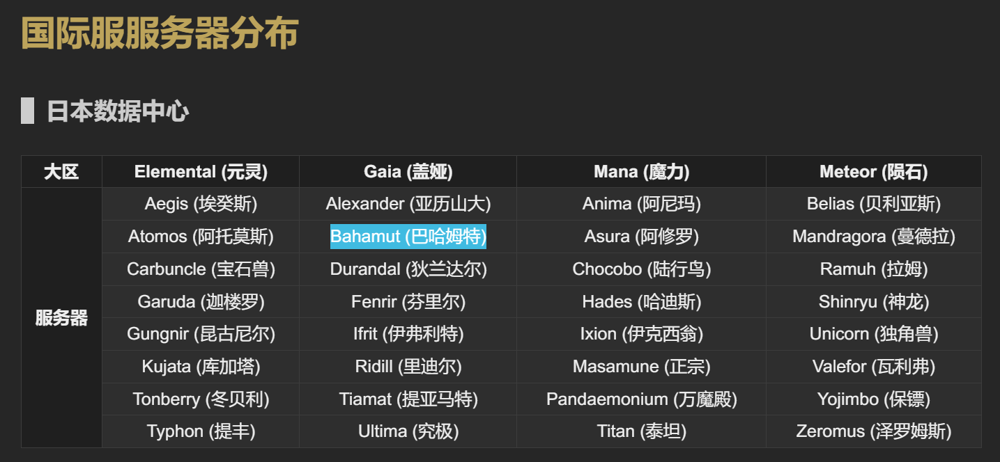

当然，服务器不同带来的限制并没有想象中那么大：

1. 在**同一个大区**里，您可以在三大主城里随时**跨域传送**到其它服务器，这时在您名称的右侧会有 <放浪神加护> 的标识，例如您可以从 Gaia - Bahamut 跨域传送到 Gaia - Ifrit 服务器。
2. 在**同一数据中心**里，您也可以在角色选择页面**超域传送**到想去的其它大区下的服务器，这时在您名称的右侧会有 <超域旅者> 的标识，例如您可以从 Gaia - Bahamut 超域传送到 Elemental - Aegis 服务器。特别的，日本数据中心可以和大洋洲数据中心相互进行超域传送。

平时排本时，会与当前大区下所有服务器的玩家（包括 <超域旅者> 们）一起匹配，协同作战。不过，由于部队、房屋等不可跨服系统的存在，能在同一个原始服务器游玩总是最好的。

就笔者的了解而言，所属日本的数据中心里，除了占比最大的日本人外：

- **Elemental** 里的英语玩家较多。
- **Gaia** 里有不少的台湾、香港玩家。
- **Mana** 里聚集着大量的国人玩家。
- **Meteor** 没有去过，不了解。

日本玩家 LuckyBancho 在他的[个人主页](https://luckybancho.ldblog.jp/)更新发布国际服各个服务器的人口统计，截止 2024.11.04，在他制定的规则下，国际服的**活跃玩家共 115 万人**（相对上个统计周期减少了 29 万人，是正常的，因为很多人完成了 7.0 版本开荒就 AFK 了）。具体到服务器的结果见下图（[Google 电子表格版本](https://docs.google.com/spreadsheets/d/1lD2BxLakUo7gx1PkZMLVsIEEWCmIYS9ag9uJfwLX-Do/edit?usp=sharing)）：

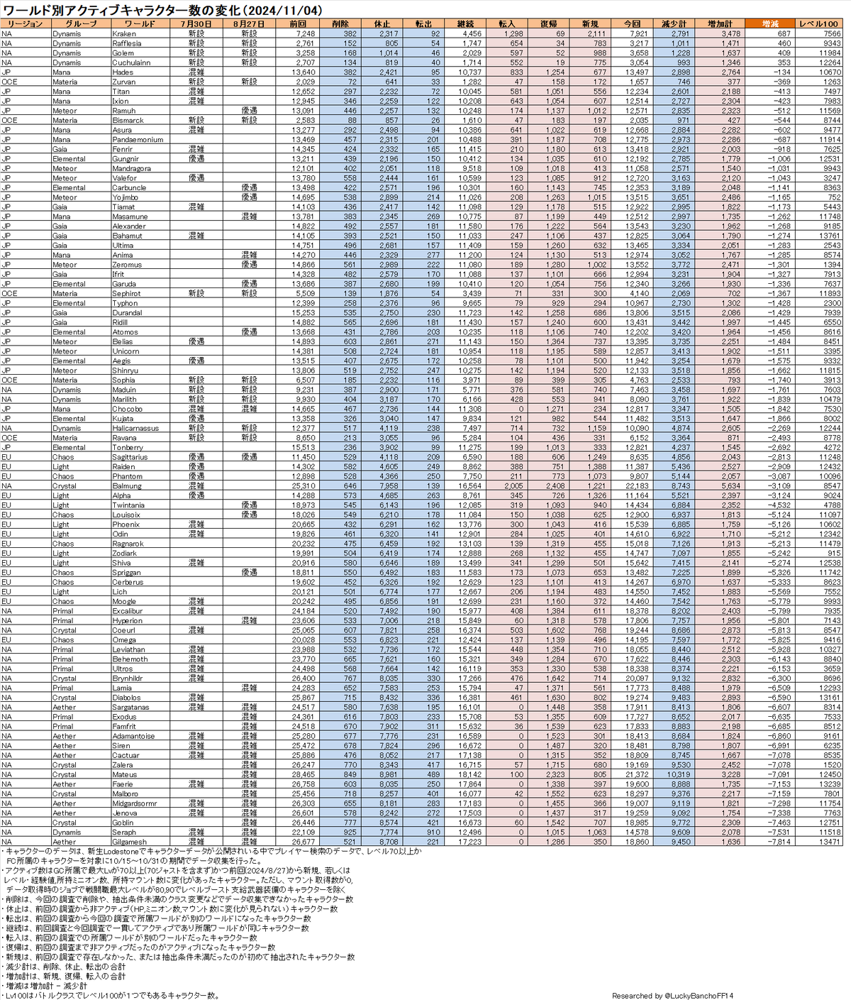

## 成为新的光之战士

战斗职业按照职责分为输出（红职）、坦克（蓝职）和治疗（绿职）。简单描述各个职业的定位与职责就是：

- 输出职业：难度最低，需要调整输出的站位，尽可能输出多的伤害。
- 坦克职业：难度中等，需要吸引怪物的仇恨，配合输出职业的站位，调谐副本的攻略节奏。承担相当于一个输出职业大约 50% 左右的输出。
- 治疗职业：难度最高，需要及时回复队友的血量，防止坦克倒下。由于身板较脆，自身也要躲开怪物的机制，避免自己暴毙。由于治疗量的溢出，还需要承担相当于一个输出职业大约 40% 左右的输出。功利地说，由于副本里怪物的总血量是固定的，你多输出点其他人就可以少输出点，攻略完成的速度也就快点 XD。

建议您在开荒时选择推主线更快，副本体验只关注自身走位和输出手法的**输出职业**。如果想挑战其他职责的职业，可以在游玩过程中学习别人的操作与技巧，再依葫芦画瓢吧！

喔对了，在您的角色名字前面有个豆芽的图标，意味着您是全游戏生态链顶层的存在，您将得到最大程度的宽容，尽可以放心大胆地玩耍，而且在国际服，不必担心有什么操作会被诋毁。

重复再提一遍，游戏前期的体验相当枯燥乏味，但随着各种玩法与副本的解锁，一天的时间都不知道该怎么安排了，每个人几乎都能找到想做的事情然后沉浸在游戏世界里。愿我们终能相遇在水晶都，好运，光之战士！

## 其它贴士

下面是一些笔者的理解与配置，应该能带给您一些有益的启发。

### 雇员

您将在 17 级的主线解锁一个永久雇员。注册 FFXIV 国际服官方 APP 后会赠送第二个永久雇员。

### 物品搜索

如果使用 FFXIVChnTextPatch-GP 对游戏客户端进行汉化，在诸如市场交易板等地方还是需要使用**日文关键字**进行搜索，此时就要使用到 Wiki 或其它工具来查询对应的道具名了，这一点着实在体验上增加了负担。

例如要搜索装备 _完满木魔导弓_，可以访问 Wiki 页面 <https://ff14.huijiwiki.com/wiki/物品:完满木魔导弓>：

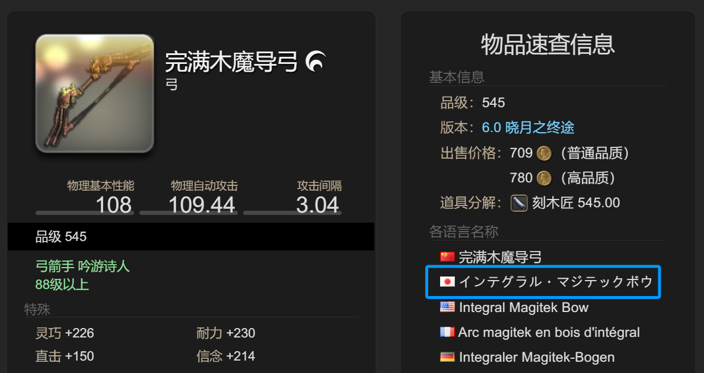

使用上图中的日文名 _インテグラル・マジテックボウ_ 在交易板搜索即可。

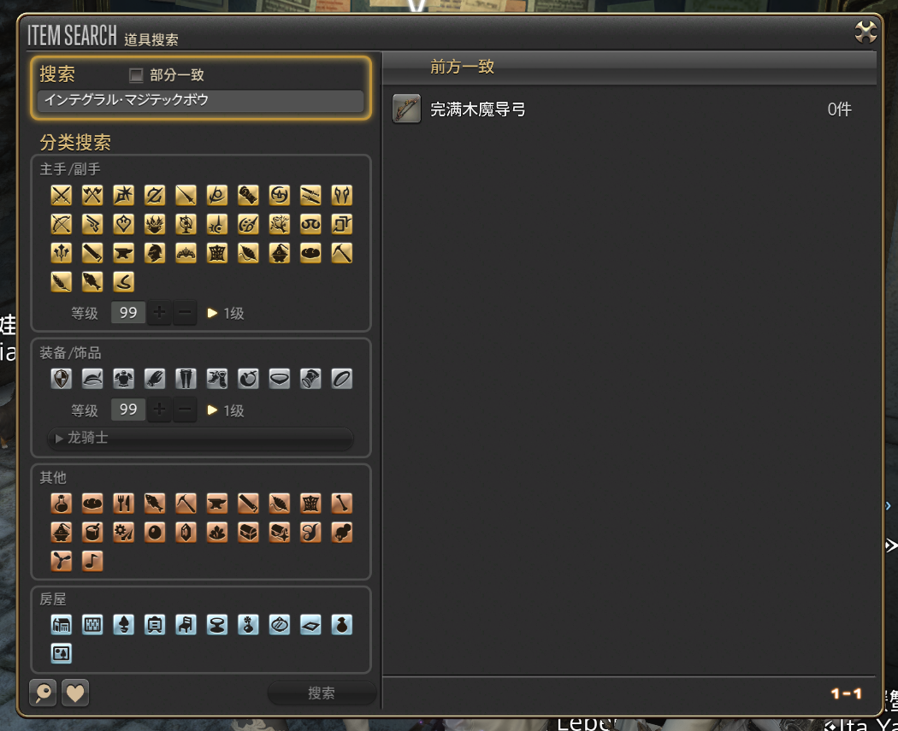

笔者则更常用开源的 [FFXIV Teamcraft](https://github.com/ffxiv-teamcraft/ffxiv-teamcraft) 工具搜索：

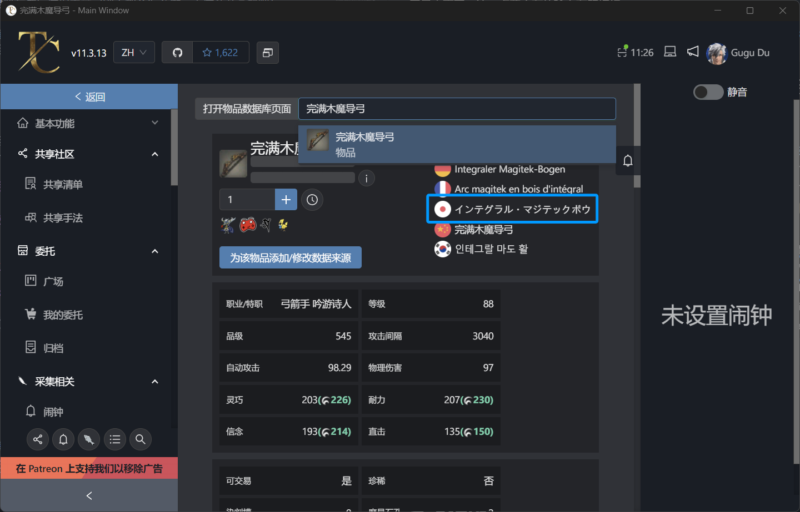

除此之外，FFXIV Teamcraft 还有很多强大的功能，例如记录生产手法，便捷配置为生产宏等，推荐给厚米们使用。

### 队伍交流

在国际服不可避免匹配到外国友人，理解队友在说什么有时候很重要（更多时候不重要）。笔者使用了开源的 [TataruAssistant](https://github.com/winw1010/tataru-assistant) 来实时翻译并记录剧情文本：

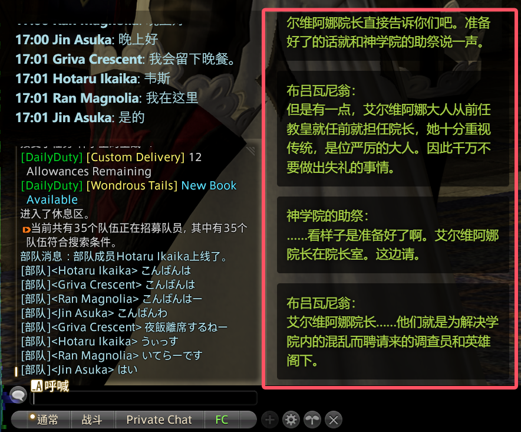

或者也可以选用传统的 [TataruHelper](https://github.com/NightlyRevenger/TataruHelper)，功能上可以更加便利地设置多窗口，但其它方面上相比 TataruAssistant 稍有逊色。

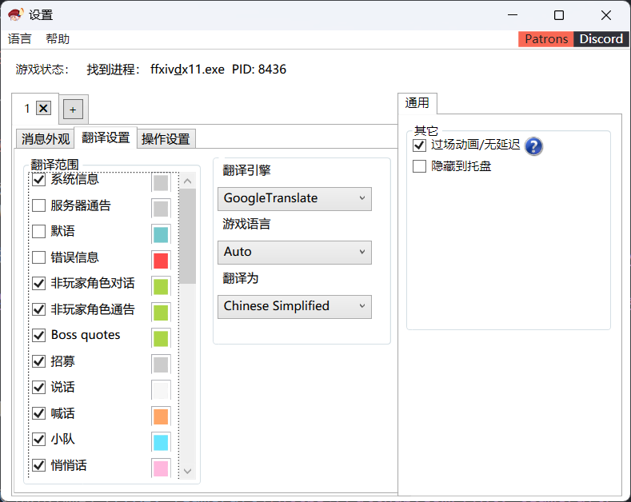

简单配置以后即可显示：

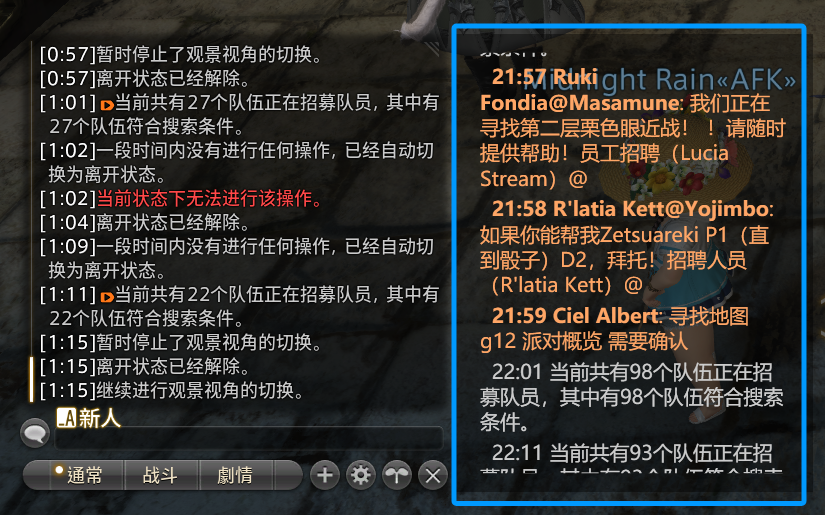

交流时优先使用定型文，其次使用日语和英语。笔者发现大多数日本玩家都是英语苦手，遇到他们看不懂的情况时，不妨通过翻译软件转换成日文再发送吧。

### 在 Steam 展示游戏状态

使用 Steam 的**添加非 Steam 游戏**功能，将 FFXIVQuickLauncher 作为游戏选中，自定义游戏名，通过 Steam 启动即可：

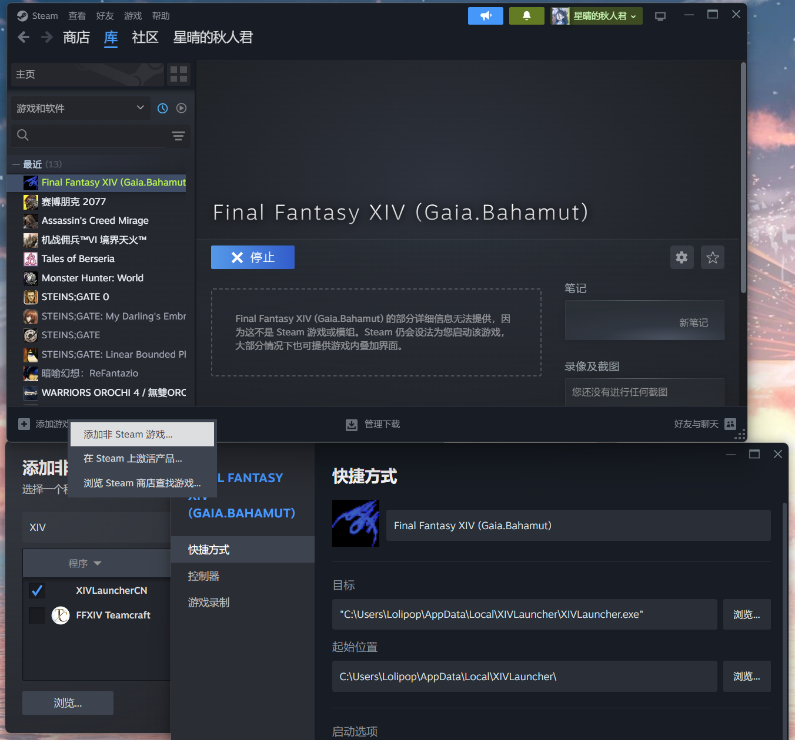

现在您的 Steam 状态栏将显示您正在游玩游戏为刚刚自定义的游戏名。

## 参考指南

如果遇到笔者没有提及的问题，可以移步下面的指南：

- [FF14国际服超详细入坑指南](https://steamcommunity.com/sharedfiles/filedetails/?l=schinese&id=2186534821)，2024.04.13
- [【FF14】国际服入坑从入门到精通](https://www.bilibili.com/read/cv11570492)，2021.06.04
- [[国际服] 9102·国际服入坑指北](https://bbs.nga.cn/read.php?tid=15259943&rand=460)，2019.02.10
