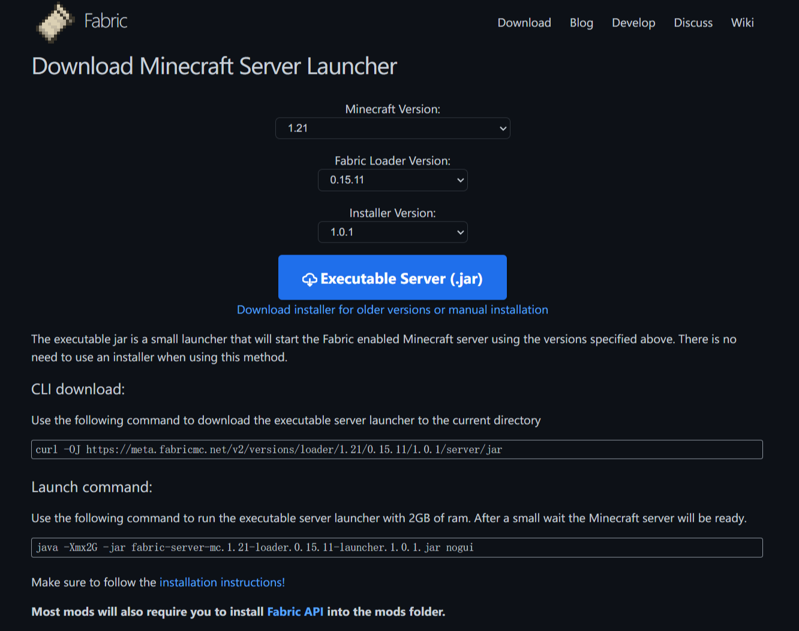
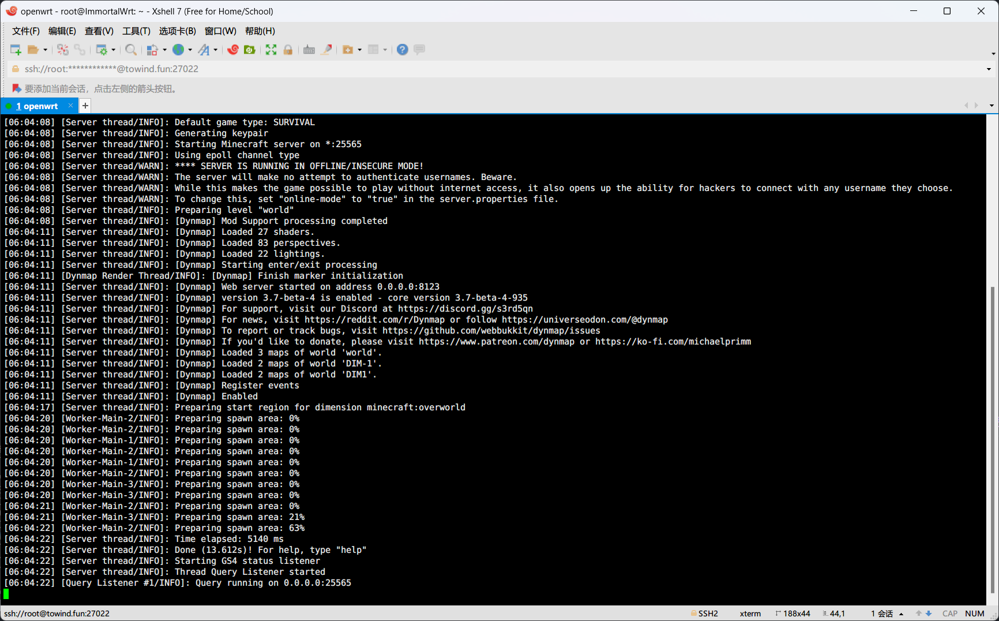
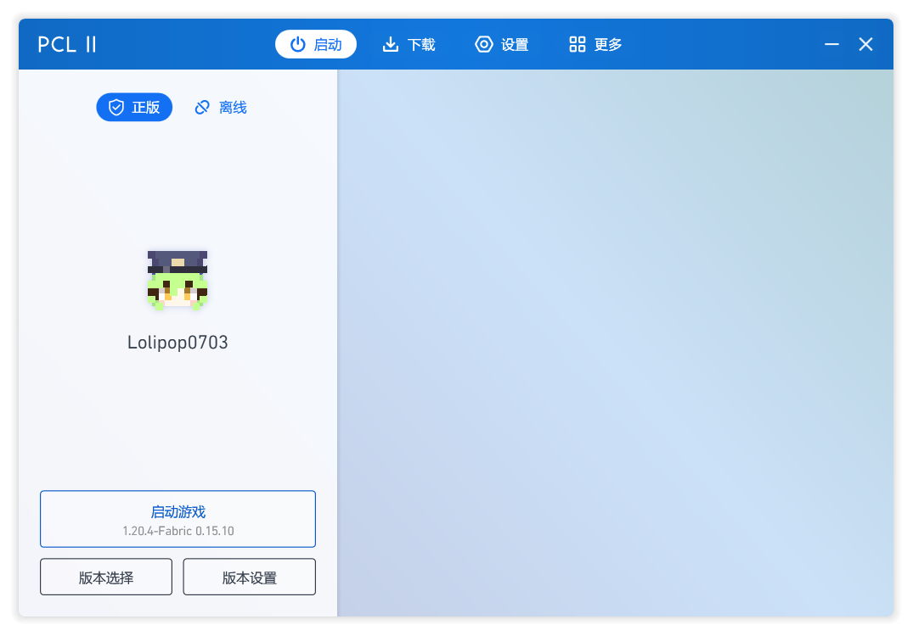

笔者在今年五月份部署了一个与朋友同玩共乐的 Minecraft 服务器，稳定运行至今。忽然想记录为一篇博客，分享分享折腾的经历。

笔者结合个人喜好（最新版本，模组优先）和大众推荐（Fabric 更适合新版本 Minecraft），决定基于 Fabric 搭建一个可以添加模组的 Minecraft 服务器。此类服务器简称为模组服务器，还有基于 [Paper](https://github.com/PaperMC/Paper), [Spigot](https://www.spigotmc.org) 等搭建的插件服务器，可以综合自身需求，选择最合适的搭建方案。

## 部署 Minecraft 服务器

### 安装 Java 环境

Java 版的 Minecraft 服务器依赖于 Java 启动，因此在一切的最开始，需要在服务器上安装 Java 环境。

Java 版的 Minecraft 自 1.18 版本开始需要 Java >= 17。参考网上俯拾皆是的教程，通过包管理工具或前往 [Oracle OpenJDK](https://jdk.java.net/) 页面下载并安装合适版本的 Java。

输入 `java -version` 命令查看是否安装成功，在笔者的服务器上打印的结果如下：

```bash
$ java -version
openjdk version "21.0.2" 2024-01-16
OpenJDK Runtime Environment (build 21.0.2+13-alpine-r0)
OpenJDK 64-Bit Server VM (build 21.0.2+13-alpine-r0, mixed mode, sharing)
```

### 下载 Minecraft 服务器启动器

前往 Fabric 提供的[下载 Minecraft 服务器启动器页面](https://fabricmc.net/use/server)，选择欲部署的 Minecraft 服务器版本，Fabric 加载器和 Fabric 模组版本：



在服务器上通过 `curl` 命令下载。如上图所示，可以执行命令：

```bash
curl -OJ https://meta.fabricmc.net/v2/versions/loader/1.21/0.15.11/1.0.1/server/jar
```

得到 Java 可执行的归档文件 `fabric-server-mc.1.21-loader.0.15.11-launcher.1.0.1.jar`。

### 启动服务器

新建一个存放 Minecraft 服务器文件的目录，移动到此目录，通过 `java` 命令执行刚刚得到的文件：

```bash
java -Xmx2G -jar fabric-server-mc.1.21-loader.0.15.11-launcher.1.0.1.jar nogui
```

将自动在**当前所在的目录**生成必要的数据文件。首次启动将会以失败告终，此时需要手动编辑目录下的 `eula.txt`，同意 Minecraft 的最终用户许可协议：

```txt
eula=true
```

再次启动就一切 OK 了。

> Minecraft 服务器默认监听 25565 端口，请确保防火墙放行了该端口的 TCP 类型请求。

测试一切正常运行，可以通过服务器公网 IP 连接到服务器后，使用 `screen` 命令管理 Minecraft 服务器进程：

```bash
screen -dmS mc-server java -Xmx2G -jar fabric-server-mc.1.21-loader.0.15.11-launcher.1.0.1.jar nogui
```

这样，我们就建立了一个名为 `mc-server` 的 Screen 终端，需要查看运行日志时使用 `screen -r mc-server` 进入。



是的，这就是全部。接下来就是发挥创造力的环节了，正如我们在 Minecraft 中一直做的那样。

## 让朋友们连接到 Minecraft 服务器

笔者推荐使用开源作者[龙腾猫跃](https://github.com/LTCatt)开发的 [Plain Craft Launcher](https://github.com/Hex-Dragon/PCL2)（[爱发电](https://afdian.net/p/0164034c016c11ebafcb52540025c377)）来下载与启动 Minecraft 客户端。

下载时需选择与服务端相同的 Fabric Loader 和 Fabric API 版本：


使用正版账号或离线账号启动客户端：



## 添加与管理模组

我们可以向 Minecraft 服务器添加各种各样的 Fabric 模组。

模组存放于服务器根目录的 `mods/` 目录下，服务器初始化后会默认包含一个 Fabric 依赖的必要模组 `mods/fabric-api-1.0.1+1.21.jar`。我们也只需要像这样，把 `.jar` 格式的模组文件放置到 `mods/` 目录下，就算成功添加模组了。

您可以在 [Modrinth](https://modrinth.com/mods) 和 [CurseForge](https://www.curseforge.com/minecraft/search?class=mc-mods) 探索和下载想要使用的模组。

下面举几个笔者使用到的模组的例子。

### AutoModpack / 自动分发客户端模组

按模组的使用环境，可以划分为以下四类：

- 客户端模组：安装在客户端。服务端安装无效。
- 服务端模组：安装在服务端。客户端安装无效。
- 客户端或服务端模组：通常安装在服务端，在客户端同时安装可以增强体验。
- 客户端和服务端模组：在客户端和服务端同时安装才有效。

为了跟朋友们都有相似的游戏体验（也顺便照顾不大懂模组安装的朋友），考虑去实现服务端与客户端的模组同步能力。笔者找到了模组 [AutoModpack](https://modrinth.com/mod/automodpack) 来实现此功能。

AutoModpack 是一个**客户端和服务端模组**，安装了此模组的客户端会自动同步服务端上托管的模组到本地，保证不同客户端体验的一致性。因此对于一起玩的朋友，只需要让他们在客户端的 `mods/` 目录下放入此模组，并在首次进入服务器时确认同步客户端模组就可以了。


对于不应当被同步到客户端去的模组，AutoModpack 也提供了简单的配置方式：以 `server-` 开头重命名文件。例如对于只需要安装在服务端的模组 [Dynmap](https://modrinth.com/plugin/dynmap)，将模组文件 `mods/Dynmap-3.7-beta-6-fabric-1.21.jar` 重命名为 `mods/server-Dynmap-3.7-beta-6-fabric-1.21.jar` 即可。

### Dynmap / 服务器地图


想要用浏览器在线查看 Minecraft 服务器地图，查看当前在线玩家的游玩情况，直接向在线的玩家发送消息？这一切仅需要一个服务端模组 [Dynmap](https://modrinth.com/plugin/dynmap) 就可以实现！

成功启用 Dynmap 后，Web 服务将默认监听本机的 8123 端口，请确保防火墙放行了该端口的 TCP 类型请求。

起始时通过浏览器查看会是一片黑暗，伴随玩家在世界里的探索，Dynmap 会逐渐绘制成形完整的地图。

### Fabric Tailor / 离线服务器自定义换肤

对于离线服务器，哪怕以正版用户的身份登录，也无法获取到自己上传的皮肤；由于技术问题，部分 Minecraft 启动器也无法修改高版本客户端的玩家皮肤。大家登入服务器发现彼此都是 N-word，实在不能带来愉快的视觉体验。

服务端模组 [Fabric Tailor](https://modrinth.com/mod/fabrictailor) 可以解决这个问题，它向游戏添加了 `/skin` 命令，玩家可以调用此命令实现自定义换肤。例如：

```bash
# 设置为指定 URL 链接对应的皮肤
/skin set URL classic https://s.namemc.com/i/b80558ff4b834410.png # 经典身材
/skin set URL slim https://s.namemc.com/i/b80558ff4b834410.png # 纤细身材

# 设置为指定正版用户上传的皮肤
/skin set player Lolipop0703
```

## 服务器运维

### 配置服务器

参考[此文档](https://minecraft.fandom.com/wiki/Server.properties)按需修改服务器根目录下的 `server.properties` 配置文件。

其中值得一提的有：

- `motd`：服务器描述信息，在服务器列表展示。可以通过这个[小工具](https://minecraft.tools/en/motd.php?motd)生成与预览。
- `online-mode`：如果你有并没有购买正版 Minecraft 的朋友，可设置为 `false` 来允许他们进入服务器。
- `spawn-protection`：出生点方块保护，默认值为 `16`，保护以出生点为中心的 `2 * 16 + 1 = 33` 块方格。可以设置小一点，避免朋友们因破坏不了方块导致的困惑。当然，如果没有设置管理员，这个选项会自动被禁用。

此外，将自定义的服务器图标保存到服务器根目录，命名为 `server-icon.png`，即可在服务器列表展示。

### 服务器状态卡片


一些开放服务可以用来查询 Minecraft 服务器状态，并生成类似上面这样的卡片。想要生成同样的卡片？访问 [MCApi.us](https://mcapi.us) 了解更多。

### 通过域名连接到服务器

假设您已拥有一个域名并通过 DNS 服务商解析到了服务器，那么连接服务器时不再需要填写服务器的公网 IP 地址，使用域名就行。

笔者的服务器就可以通过域名 `mc.towind.fun` 连接，Minecraft 客户端将查询到域名背后的 IP 地址，访问其 25565 端口。

假设您还安装和配置好了 Nginx 服务，我们可以将服务器地图进行转发。例如：

```HOCON
server {
  listen 443 ssl;
  ssl_certificate /path/to/fullchain.pem;
  ssl_certificate_key /path/to/privkey.pem;

  server_name mc.towind.fun;

  location /map/ {
    proxy_pass http://127.0.0.1:8123/;
  }
}
```

现在，我们不再需要放行 8123 端口，服务器地图通过 Nginx 监听的 443 端口转发，访问链接 <https://mc.towind.fun/map> 即可。

### 服务器备份

时常 Minecraft 备份服务器数据并上传到云盘是一个非常好的习惯，笔者在里实现了数据的定时备份与上传，供君参考。
